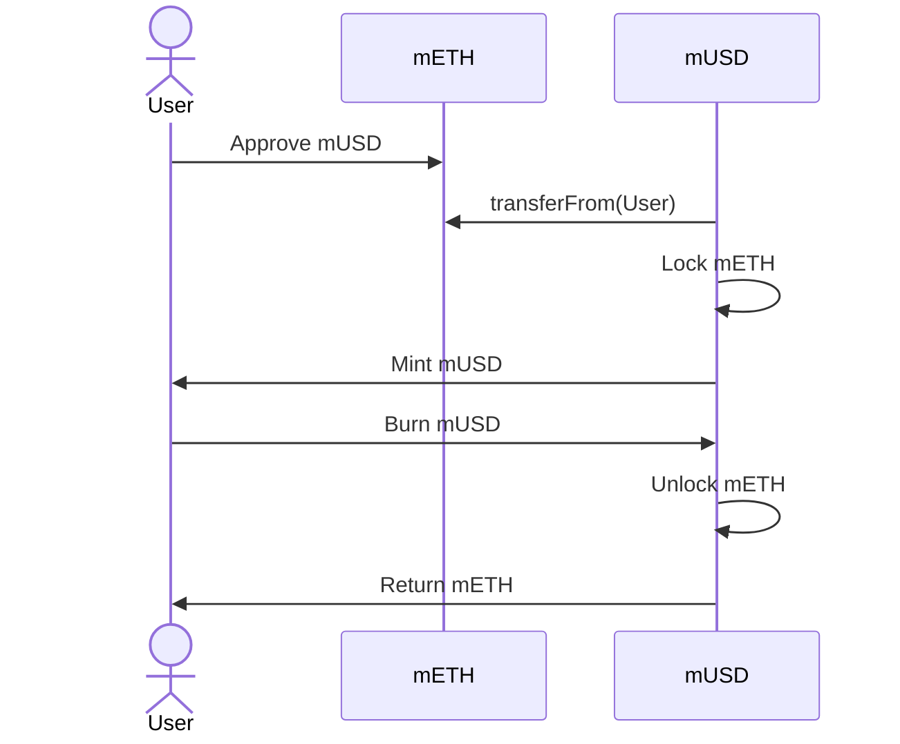
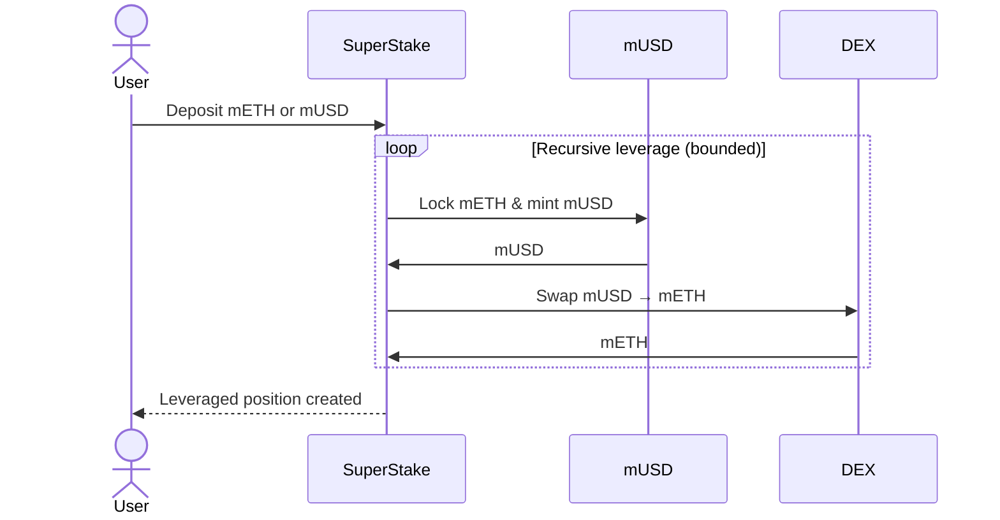
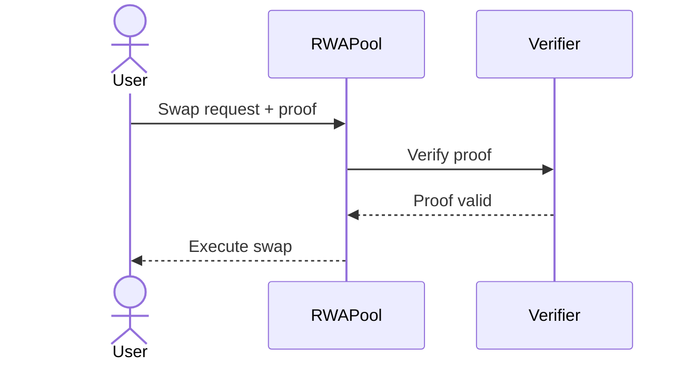
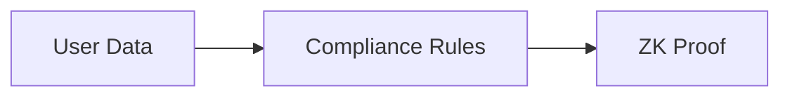
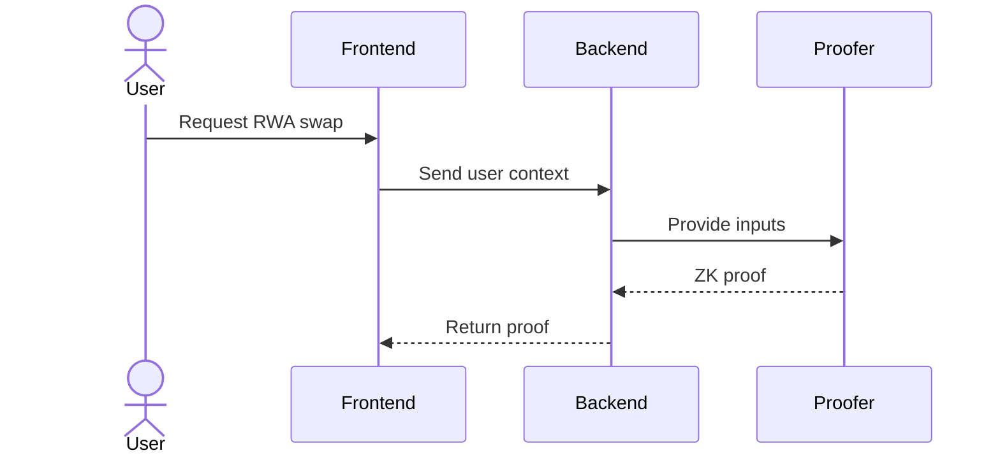
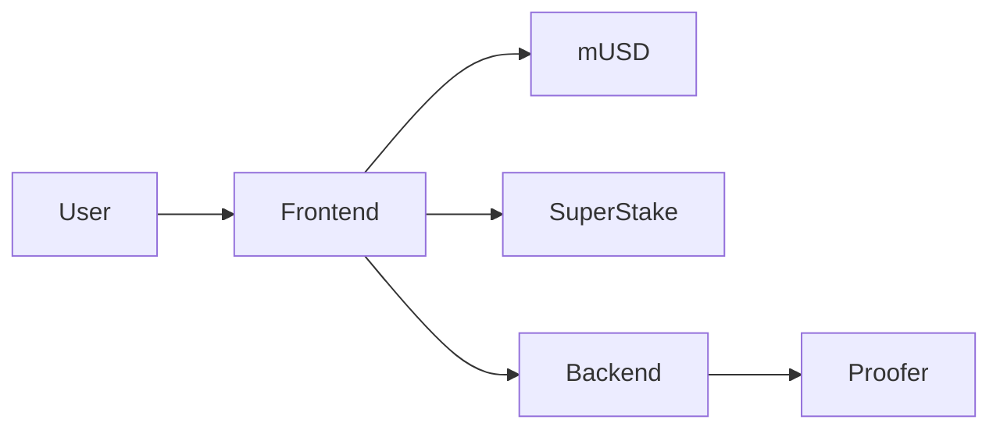
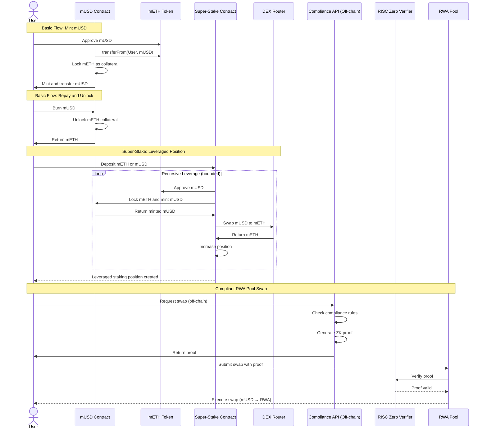

## Introduction
mUSD is a **Mantle-native, mETH-backed stablecoin** designed to be:

- **Overcollateralized** (lock mETH → mint mUSD)
- **Composable** (used in DeFi and RWA markets)
- **Extensible** (supports leverage via Super-Stake)
- **Compliance-aware** (RWA pools gated by ZK proofs)

The protocol consists of:

- A **core mUSD contract** for minting and redemption
- A **Super-Stake contract** for recursive leveraged staking
- **Compliant RWA liquidity pools** gated by RISC Zero proofs
- An **off-chain compliance + proof generation flow**
- A user-facing frontend and backend middleware

## Main Components

### Smart Contracts
This layer contains all **on-chain financial logic**.

### Responsibilities

- Lock mETH and mint mUSD
- Burn mUSD and unlock mETH
- Automate leveraged positions via Super-Stake
- Enforce compliance at RWA pools (via verifier)

#### 1. mUSD Core Contract

**Purpose:**

Manages collateralization and stablecoin issuance.

**Key rules:**

- Only **mETH** is accepted as collateral
- Users mint mUSD up to a fixed LTV
- Burning mUSD unlocks the user’s mETH

### Flow: Mint & Redeem

#### 2. Super-Stake Contract

**Purpose:**

Allows users to **leverage** their staking position through controlled recursion automatically.

**What it does:**

- Accepts mETH or mUSD
- Mints mUSD against mETH
- Swaps mUSD → mETH
- Repeats the process a bounded number of times

This maximizes staking exposure **without manual looping**.

#### Flow: Recursive Leverage

#### 3. Compliant RWA Pools (On-chain)

**Purpose:**

Create **regulated liquidity pools** such as:

- mUSD ↔ Gold
- mUSD ↔ Money Market
- mUSD ↔ Real Estate

**Key idea:**

The pool itself is on-chain and simple, but **swaps are gated** by a zero-knowledge proof.

### Flow: Proof-Gated Swap

## Proofer
The **Proofer** is an **off-chain ZK proving system** built using **RISC Zero**.

### Responsibilities

- Encode compliance logic (KYC, jurisdiction, limits, etc.)
- Generate a **zero-knowledge proof**
- Ensure **no personal data** is exposed on-chain

### What the proof asserts (examples)

- User passed KYC
- User is allowed to trade this RWA
- User has not exceeded allowed limits

### Proofer Conceptual Flow

## Backend Middleware Service

### To Send Proofer Data (Proofer Inputs)
This service acts as the bridge between the frontend and the proofer.
### Responsibilities

- Receive swap intent from frontend
- Fetch / validate compliance inputs
- Call the proofer
- Return a proof usable on-chain

This keeps:

- Frontend simple
- Prover isolated
- Compliance logic upgradeable
  
### Backend Flow

## Frontend
The frontend is the **single user entry point**.

### Responsibilities

- Wallet connection
- mUSD mint / burn UI
- Super-Stake position creation
- RWA swaps with compliance handling
- Clear UX around leverage and compliance

### Frontend Interaction Overview

### Overall Architecture

