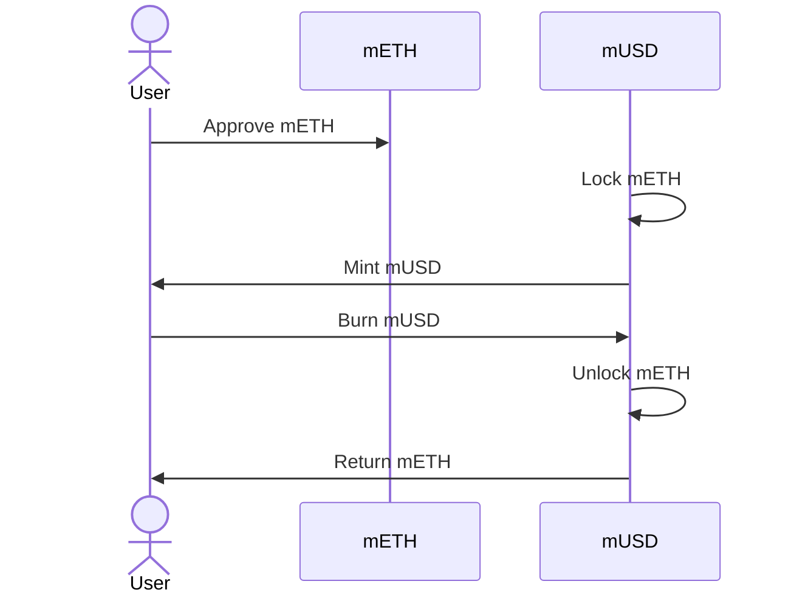
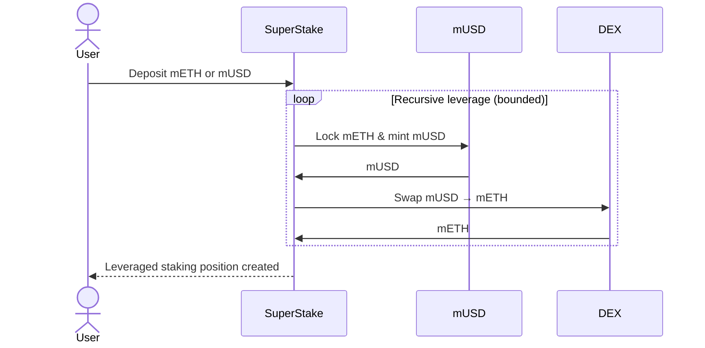
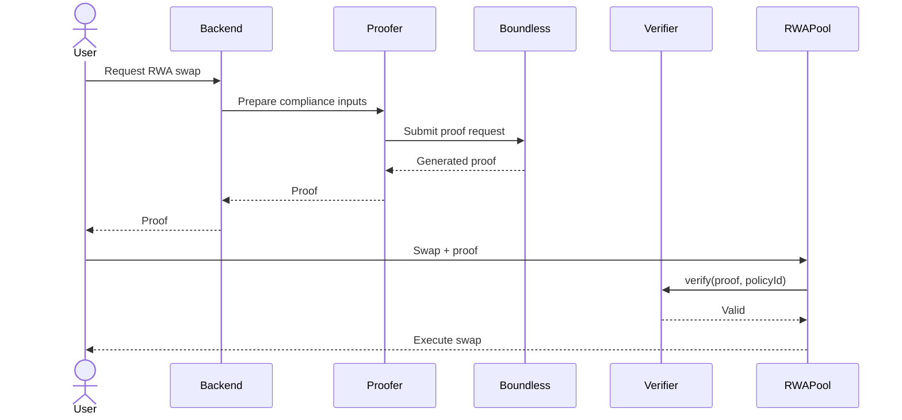
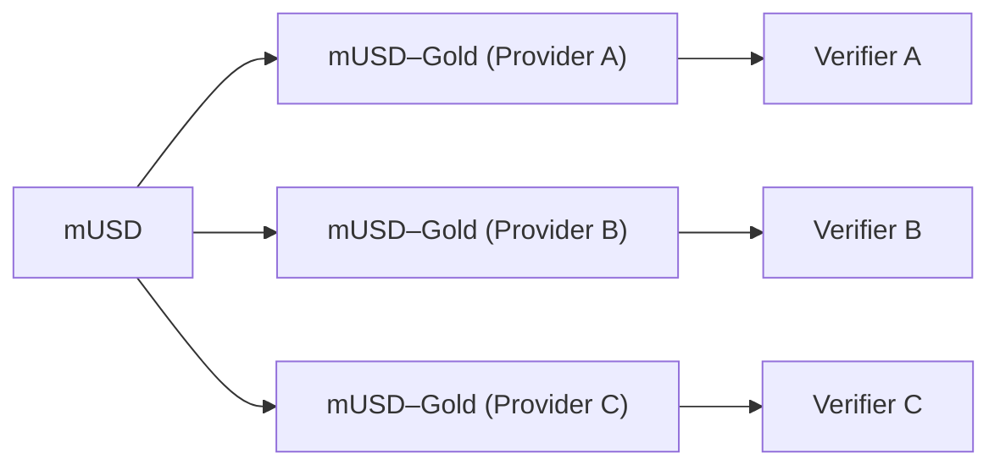
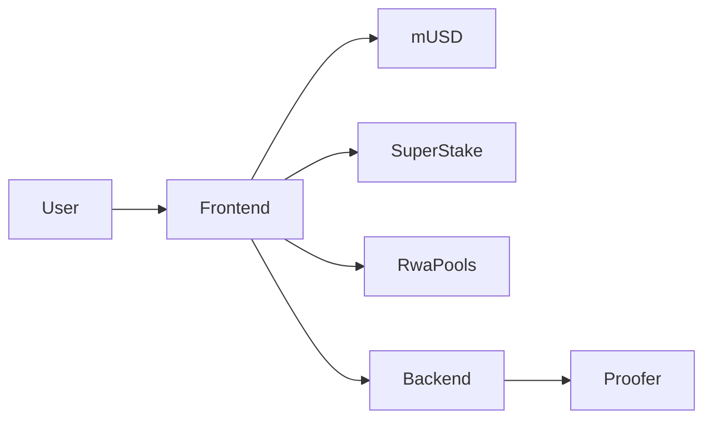
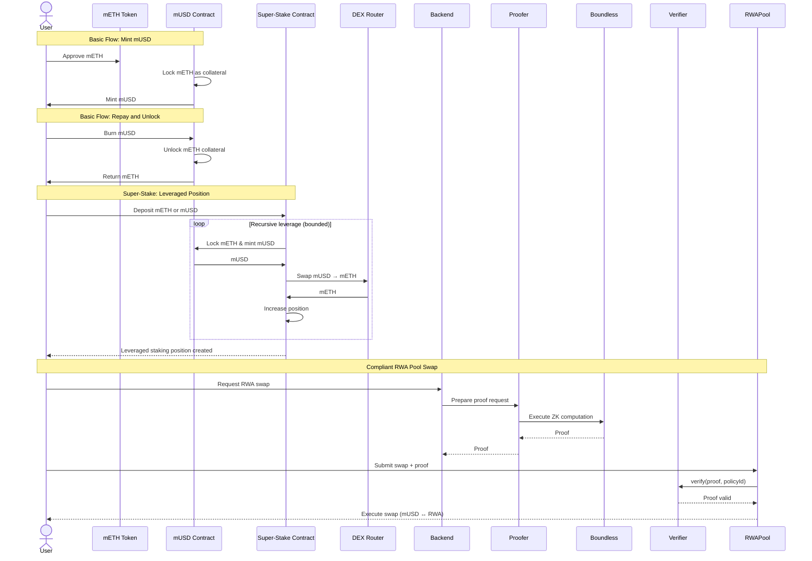

# mUSD Protocol

mUSD is a **Mantle-native, mETH-backed stablecoin** designed to be:

* **Overcollateralized** (lock mETH → mint mUSD)
* **Composable** (used in DeFi and RWA markets)
* **Extensible** (supports leverage via Super-Stake)
* **Compliance-aware** (RWA pools gated by zero-knowledge proofs)

The protocol consists of:

* A **core mUSD contract** for minting and redemption
* A **Super-Stake contract** for recursive leveraged staking
* **Compliant RWA liquidity pools** gated by ZK proofs
* A **modular off-chain compliance + proof orchestration system**
* A user-facing frontend and backend middleware

## Deployed Contracts (Mantle Sepolia)

### Standard / Mock Contracts (Test Utilities)

* **mETH (Mock Collateral Token)**
  [https://sepolia.mantlescan.xyz/address/0xDd37c9e2237506273F86dA1272Ca51470dF6e8ae](https://sepolia.mantlescan.xyz/address/0xDd37c9e2237506273F86dA1272Ca51470dF6e8ae)

  * **Gold (Mock RWA Token)**
  [https://sepolia.mantlescan.xyz/address/0x4ABD994Dd8e6581d909A6AcEf82e453d3E141d65](https://sepolia.mantlescan.xyz/address/0x4ABD994Dd8e6581d909A6AcEf82e453d3E141d65)

  * **Real Estate  Share (Mock RWA Token)**
  [https://sepolia.mantlescan.xyz/address/0x4B55670F4D1e6E2dcafC975931e7BeFeF73cFC53](https://sepolia.mantlescan.xyz/address/0x4B55670F4D1e6E2dcafC975931e7BeFeF73cFC53)

  * **Money Market Share (Mock RWA Token)**
  [https://sepolia.mantlescan.xyz/address/0x8D2D9cf7750C88881E12A33D6e305640CDBf020a](https://sepolia.mantlescan.xyz/address/0x8D2D9cf7750C88881E12A33D6e305640CDBf020a)

* **Swapper (DEX / Swap Router Mock)**
  [https://sepolia.mantlescan.xyz/address/0x35cc0a5400D745EE96B082a9c70Cf7de44FAAFD3](https://sepolia.mantlescan.xyz/address/0x35cc0a5400D745EE96B082a9c70Cf7de44FAAFD3)

* **ZK Verifier (Boundless / RISC Zero)**
  [https://sepolia.mantlescan.xyz/address/0xDBCf221465348424E6e30c95Ff8c3837427A191c](https://sepolia.mantlescan.xyz/address/0xDBCf221465348424E6e30c95Ff8c3837427A191c)

* **Boundless Network Verifier (Ethereum Sepolia)**
  [https://sepolia.etherscan.io/address/0xc211b581cB62e3a6D396A592Bab34979E1bBBA7D](https://sepolia.etherscan.io/address/0xc211b581cB62e3a6D396A592Bab34979E1bBBA7D)


### Platform Contracts

* **mUSD Core Contract**
  [https://sepolia.mantlescan.xyz/address/0x1ADE47C51C4850EcAc5F46Bb9C86835dc2EB5354](https://sepolia.mantlescan.xyz/address/0x1ADE47C51C4850EcAc5F46Bb9C86835dc2EB5354)

* **Super-Stake Contract**
  [https://sepolia.mantlescan.xyz/address/0x915b4a846bD04180F044214a15446eBd680a64D7](https://sepolia.mantlescan.xyz/address/0x915b4a846bD04180F044214a15446eBd680a64D7)

* **RWA Pool Factory**
  [https://sepolia.mantlescan.xyz/address/0x189956C062728196452Fe4330544e1d77D0b01BC](https://sepolia.mantlescan.xyz/address/0x189956C062728196452Fe4330544e1d77D0b01BC)

* **Gold Pool**
  [https://sepolia.mantlescan.xyz/address/0x43bfa0778fc67dab8b26fc73b768c03680a13670](https://sepolia.mantlescan.xyz/address/0x43bfa0778fc67dab8b26fc73b768c03680a13670)

* **Real Estate Pool**
  [https://sepolia.mantlescan.xyz/address/0xbbfb84101adf968962026abac9006cb62b4e1ace](https://sepolia.mantlescan.xyz/address/0xbbfb84101adf968962026abac9006cb62b4e1ace)

* **Money Market Pool**
  [https://sepolia.mantlescan.xyz/address/0x880ce950258e591c4360030fc8675d3e33de3aef](https://sepolia.mantlescan.xyz/address/0x880ce950258e591c4360030fc8675d3e33de3aef)

### Mantle Subgraph & GraphQL

* **Mantle Subgraph Dashboard**
  [https://subgraph.mantle.xyz/dashboard/list?name=mUSD](https://subgraph.mantle.xyz/dashboard/list?name=mUSD)

* **GraphQL Endpoint**
  [https://subgraph-api.mantle.xyz/api/public/cb8f3ffc-3a59-4f07-9dbc-d92b7b588833/subgraphs/mUSD/0.0.1/gn](https://subgraph-api.mantle.xyz/api/public/cb8f3ffc-3a59-4f07-9dbc-d92b7b588833/subgraphs/mUSD/0.0.1/gn)
### Rust Middleware (Proof Submitter to decentralized proofers marketplace [Boundless](https://boundless.network/))

https://mantle-usd.onrender.com

### Platform Setup Script

To run the end-to-end platform configuration on Mantle Sepolia:

```bash
cd smart-contracts/mUSD
forge script script/Setup.s.sol:SetupScript \
  --rpc-url https://rpc.sepolia.mantle.xyz \
  --broadcast
```


## Main Components

## Smart Contracts

This layer contains all **on-chain financial logic**.

### Responsibilities

* Lock mETH and mint mUSD
* Burn mUSD and unlock mETH
* Automate leveraged positions via Super-Stake
* Route swaps through **compliant RWA pools**


## 1. mUSD Core Contract

### Purpose

Manages collateralization and stablecoin issuance.

### Key Rules

* Only **mETH** is accepted as collateral
* Users mint mUSD up to a fixed LTV
* Burning mUSD unlocks the user’s mETH

### Flow: Mint & Redeem




## 2. Super-Stake Contract

### Purpose

Allows users to **leverage their staking position** through controlled recursion.

### What It Does

* Accepts mETH or mUSD
* Mints mUSD against mETH
* Swaps mUSD → mETH
* Repeats the process a bounded number of times

This maximizes staking exposure **without manual looping**.

### Flow: Recursive Leverage




## 3. Compliant RWA Pools (On-chain)

### Purpose

Enable **regulated real-world asset markets** denominated in mUSD, such as:

* mUSD ↔ Gold
* mUSD ↔ Money Market Shares
* mUSD ↔ Real Estate
* mUSD ↔ Bonds

Each RWA pool is **independent** and represents:

* A specific **asset**
* A specific **issuer / provider**
* A specific **compliance policy**
* A specific **ZK verifier**


### Core Design Principle

Each RWA pool defines its **own verifier and compliance policy**.

This enables:

* Multiple pools for the same asset
* Different providers and jurisdictions
* Different compliance requirements
* Parallel regulated markets

There is no shared global compliance rule.


## Modular ZK Compliance Model

### How Compliance Is Structured

* Compliance logic lives **off-chain**
* The protocol **does not execute ZK computation itself**
* The proofer only **submits proof requests** and retrieves results
* ZK proofs are generated via the **Boundless network**
  [https://boundless.network/](https://boundless.network/)

Each RWA pool is configured with:

* A verifier contract address
* A policy identifier (program hash / imageId)

The system is ZK-provider agnostic and supports multiple verifiers simultaneously.


### Flow: Compliance via Boundless




### Multiple Pools for the Same Asset



Each pool:

* Uses its own verifier
* Can rely on a different ZK backend
* Enforces isolated compliance guarantees


## Proofer (Off-chain)

The **Proofer** is a thin off-chain component responsible for **orchestrating proof requests**.

The proofer:

* Does **not** perform ZK computation
* Does **not** generate proofs locally
* Delegates all computation to **Boundless**
* Retrieves finalized proofs and forwards them

This avoids centralized prover infrastructure and improves decentralization.


## Backend Middleware Service

### Purpose

Acts as the **coordination layer**, not a computation layer.

### Responsibilities

* Receive swap intent
* Select the correct compliance policy and pool
* Invoke the proofer (which calls Boundless)
* Return proofs to the frontend


## Frontend

The frontend is the **single user entry point**.



### Responsibilities

* Wallet connection
* mUSD mint / burn
* Super-Stake interactions
* RWA swaps with compliance handling
* Clear UX around leverage and regulation


## Overall Architecture



## Project Progress & Task Dashboard

Development tasks, milestones, and feature progress are tracked publicly using GitHub Projects:

https://github.com/users/yehia67/projects/4/views/2

