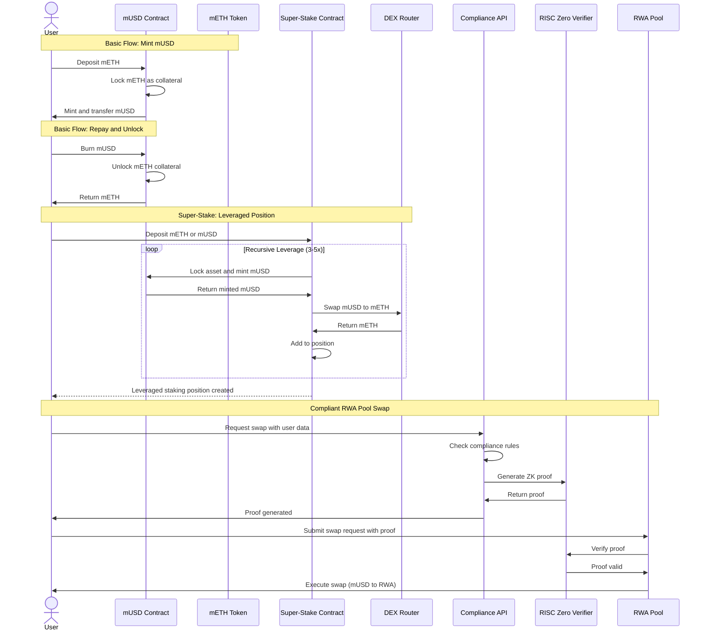

```mermaid
sequenceDiagram
    actor User
    participant mUSD as mUSD Contract
    participant mETH as mETH Token
    participant SuperStake as Super-Stake Contract
    participant DEX as DEX Router
    participant Compliance as Compliance API
    participant Verifier as RISC Zero Verifier
    participant RWAPool as RWA Pool

    %% ========= BASIC mUSD MINTING =========
    Note over User,mETH: Basic Flow: Mint mUSD
    User->>mUSD: Deposit mETH
    mUSD->>mUSD: Lock mETH as collateral
    mUSD->>User: Mint and transfer mUSD
    
    Note over User,mUSD: Basic Flow: Repay and Unlock
    User->>mUSD: Burn mUSD
    mUSD->>mUSD: Unlock mETH collateral
    mUSD->>User: Return mETH

    %% ========= SUPER STAKE LEVERAGE =========
    Note over User,DEX: Super-Stake: Leveraged Position
    User->>SuperStake: Deposit mETH or mUSD
    
    loop Recursive Leverage (3-5x)
        SuperStake->>mUSD: Lock asset and mint mUSD
        mUSD->>SuperStake: Return minted mUSD
        SuperStake->>DEX: Swap mUSD to mETH
        DEX->>SuperStake: Return mETH
        SuperStake->>SuperStake: Add to position
    end
    
    SuperStake-->>User: Leveraged staking position created

    %% ========= COMPLIANT RWA SWAP =========
    Note over User,RWAPool: Compliant RWA Pool Swap
    User->>Compliance: Request swap with user data
    Compliance->>Compliance: Check compliance rules
    Compliance->>Verifier: Generate ZK proof
    Verifier->>Compliance: Return proof
    Compliance->>User: Proof generated
    
    User->>RWAPool: Submit swap request with proof
    RWAPool->>Verifier: Verify proof
    Verifier->>RWAPool: Proof valid
    RWAPool->>User: Execute swap (mUSD to RWA)
```
