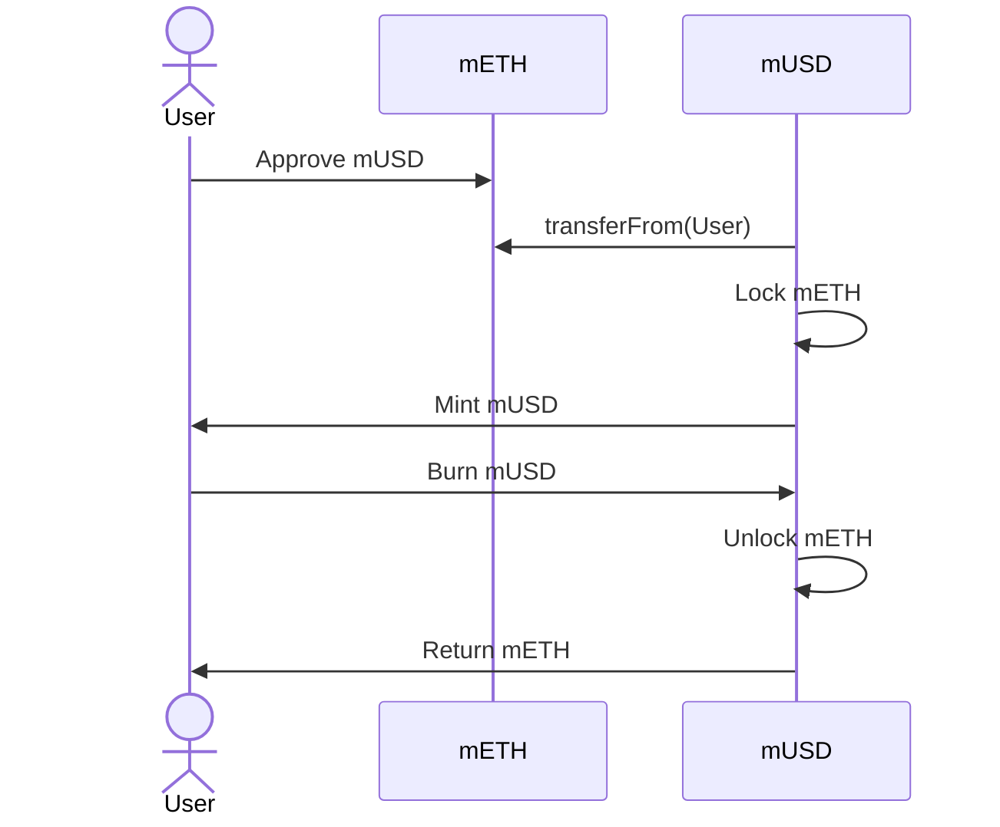
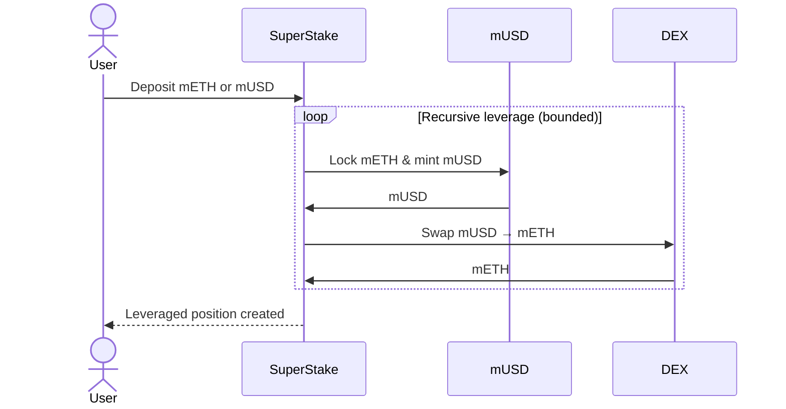
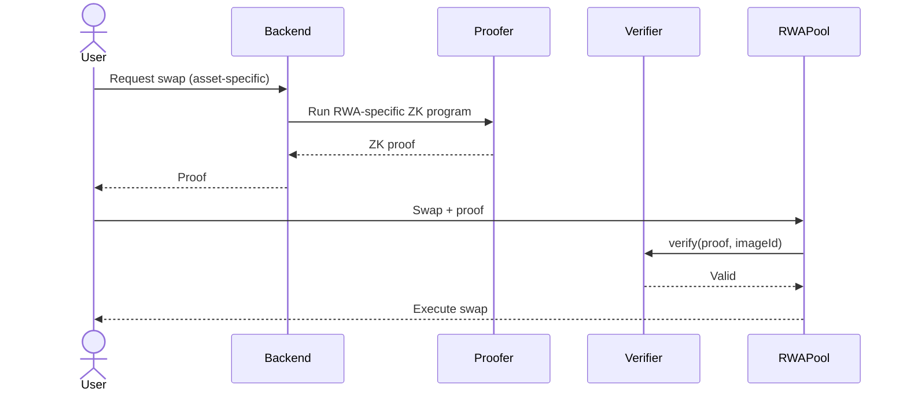
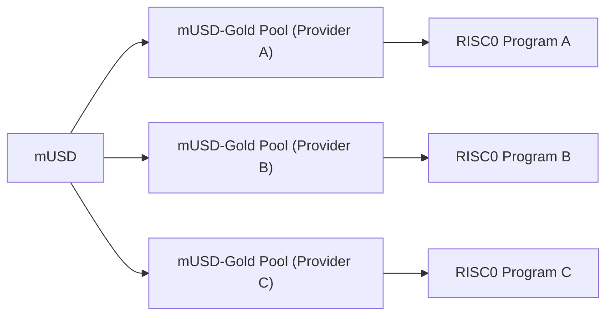
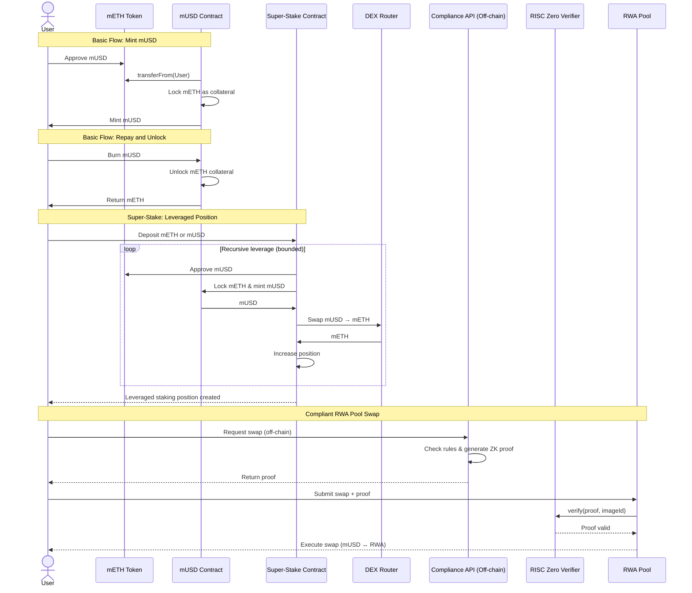

# mUSD Protocol

mUSD is a **Mantle-native, mETH-backed stablecoin** designed to be:

* **Overcollateralized** (lock mETH → mint mUSD)
* **Composable** (used in DeFi and RWA markets)
* **Extensible** (supports leverage via Super-Stake)
* **Compliance-aware** (RWA pools gated by ZK proofs)

The protocol consists of:

* A **core mUSD contract** for minting and redemption
* A **Super-Stake contract** for recursive leveraged staking
* **Compliant RWA liquidity pools** gated by RISC Zero proofs
* A **modular off-chain compliance + proof generation system**
* A user-facing frontend and backend middleware

## Deployed Contracts (Mantle Sepolia)

### Standard / Mock Contracts (Test Utilities)

* **mETH (Mock Collateral Token)**
  [https://sepolia.mantlescan.xyz/address/0xdd37c9e2237506273f86da1272ca51470df6e8ae](https://sepolia.mantlescan.xyz/address/0xdd37c9e2237506273f86da1272ca51470df6e8ae)

* **Swapper (DEX / Swap Router Mock)**
  [https://sepolia.mantlescan.xyz/address/0x25056e9611ff37988D25e8D00148EE85D85093b9](https://sepolia.mantlescan.xyz/address/0x25056e9611ff37988D25e8D00148EE85D85093b9)

* **RISC Zero Verifier (Boundless)**
  [https://sepolia.mantlescan.xyz/address/0x3760da9653cc7f653ffe664ba4cc3a3f7f3b3ea2](https://sepolia.mantlescan.xyz/address/0x3760da9653cc7f653ffe664ba4cc3a3f7f3b3ea2)

### Platform Contracts

* **mUSD Core Contract**
  [https://sepolia.mantlescan.xyz/address/0x769Ac3DFC4464481847d82dC9afA3399b9489821](https://sepolia.mantlescan.xyz/address/0x769Ac3DFC4464481847d82dC9afA3399b9489821)

* **Super-Stake Contract**
  [https://sepolia.mantlescan.xyz/address/0x51377d22096C7CB25b20622Ec33804dc132BDfF6](https://sepolia.mantlescan.xyz/address/0x51377d22096C7CB25b20622Ec33804dc132BDfF6)

* **RWA Pool Factory**
  [https://sepolia.mantlescan.xyz/address/0x1BD389dC8436B1b7BA5796abB6c78b4F89dbfC51](https://sepolia.mantlescan.xyz/address/0x1BD389dC8436B1b7BA5796abB6c78b4F89dbfC51)

## Main Components

## Smart Contracts

This layer contains all **on-chain financial logic**.

### Responsibilities

* Lock mETH and mint mUSD
* Burn mUSD and unlock mETH
* Automate leveraged positions via Super-Stake
* Route swaps through **compliant RWA pools**

## 1. mUSD Core Contract

### Purpose

Manages collateralization and stablecoin issuance.

### Key Rules

* Only **mETH** is accepted as collateral
* Users mint mUSD up to a fixed LTV
* Burning mUSD unlocks the user’s mETH

### Flow: Mint & Redeem

## 2. Super-Stake Contract

### Purpose

Allows users to **leverage their staking position** through controlled recursion.

### What It Does

* Accepts mETH or mUSD
* Mints mUSD against mETH
* Swaps mUSD → mETH
* Repeats the process a bounded number of times

This maximizes staking exposure **without manual looping**.

### Flow: Recursive Leverage

## 3. Compliant RWA Pools (On-chain)

### Purpose

Enable **regulated real-world asset markets** denominated in mUSD, such as:

* mUSD ↔ Gold
* mUSD ↔ Money Market Shares
* mUSD ↔ Real Estate
* mUSD ↔ Bonds

Each RWA pool is **independent** and represents:

* A specific **asset**
* A specific **issuer / provider**
* A specific **compliance policy**

### Core Design Principle (Important)

> **Each RWA pool has its own compliance logic, verifier configuration, and policy.**

This means:

* You can have **multiple mUSD–Gold pools**
* Each pool may correspond to:

  * A different gold issuer
  * A different jurisdiction
  * A different regulatory regime
* Each pool enforces compliance **independently**

## Modular ZK Compliance Model

### How Compliance Is Structured

* Compliance logic lives **off-chain**
* Each RWA provider defines its own **RISC Zero program**
* Each program produces proofs for **that specific asset**
* Each pool is configured with:

  * A verifier address
  * An expected program / policy (imageId)

This enables **programmatic, per-asset compliance**.

### Flow: Modular Compliance per Pool

### Multiple Pools

Each pool:

* Uses a **different ZK program**
* Encodes **different compliance rules**
* Remains isolated from others

## Proofer (Off-chain)

The **Proofer** is an off-chain ZK system built using **RISC Zero**.

### Responsibilities

* Encode asset-specific compliance logic
* Generate zero-knowledge proofs
* Ensure **no personal data** is revealed on-chain

### Proof Assertions (Examples)

* User passed KYC for *this* asset
* User is allowed to trade with *this* provider
* User investment limits are respected

## Backend Middleware Service

### Purpose

Acts as the **bridge** between frontend and prover.

### Responsibilities

* Receive swap intent
* Collect asset-specific compliance inputs
* Invoke the correct RISC Zero program
* Return proof to the frontend

## Frontend

The frontend is the **single user entry point**.

### Responsibilities

* Wallet connection
* mUSD mint / burn
* Super-Stake interactions
* RWA swaps with compliance handling
* Clear UX around leverage and regulation

## Overall Architecture 

